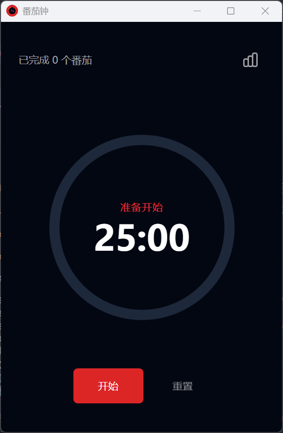
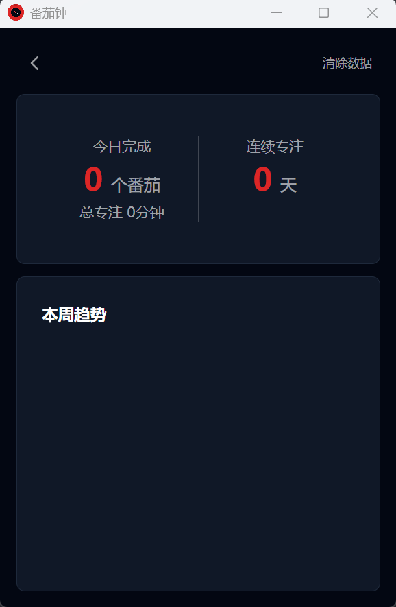

# 番茄钟桌面应用

基于 Electron + React 19 的番茄钟桌面软件，支持数据统计和多种通知方式。

## 截图





## 功能特性

- **标准番茄钟**：25分钟专注 + 5分钟短休息，每4个番茄后15分钟长休息
- **数据持久化**：sql.js (SQLite in WASM) 本地文件存储，跨会话保留
- **完整统计**：今日完成数、本周趋势图表
- **多种通知**：系统桌面通知 + 提示音 + 桌面悬浮窗口
- **深色主题**：护眼深色界面设计
- **系统托盘**：运行在 Windows 通知区域，最小化不占任务栏

## 技术栈

| 层级     | 技术                           |
| -------- | ------------------------------ |
| 桌面框架 | Electron 28                    |
| 前端框架 | React 19 + Hooks               |
| 构建工具 | Vite+ (vp) + esbuild           |
| 类型检查 | TypeScript (tsgo)              |
| UI 组件  | shadcn/ui + Radix UI           |
| 样式     | Tailwind CSS 4 (Lightning CSS) |
| 数据库   | sql.js (SQLite in WASM)        |
| 测试     | Playwright + Vitest            |

## 文件架构

```
tomato-clock/
├── electron/                   # Electron 主进程
│   ├── main.ts                # 主进程入口 + HTTP 服务器
│   ├── preload.ts             # 预加载脚本
│   └── database.ts            # sql.js 数据库封装
├── src/                        # React 渲染进程
│   ├── components/
│   │   ├── Timer/            # 计时器组件
│   │   ├── Stats/            # 统计组件
│   │   ├── Notification/      # 通知组件
│   │   └── ui/               # shadcn/ui 基础组件
│   ├── hooks/                 # 自定义 Hooks
│   ├── pages/                 # 页面组件
│   ├── types/                 # 类型定义
│   ├── schemas/               # Zod 验证 Schema
│   └── router.tsx            # 路由配置
├── scripts/
│   └── build-electron.mjs     # Electron 构建脚本
├── docs/screenshots/          # 项目截图
├── dist/                      # Vite 构建输出
├── dist-electron/             # Electron 构建输出
└── electron-builder.yml       # electron-builder 配置
```

## 快速开始

### 安装依赖

```bash
npm install
```

### 开发模式

```bash
npm run dev              # Vite+ 开发服务器
npm run electron:dev    # 开发服务器 + Electron 主进程
```

### 构建应用

```bash
npm run build            # 完整构建（tsgo + vp build + electron）
npm run build:electron   # 仅 Electron 主进程
npm run electron:build   # 打包为安装程序
```

### 类型检查与测试

```bash
npm run typecheck        # tsgo 类型检查
npm test                # vitest 测试
npm test -- path/to     # 运行指定测试文件
```

## 数据存储

数据库文件位于 Electron 用户数据目录：

```javascript
// 存储路径
app.getPath('userData') + '/tomato-clock.db'
```

| 操作系统 | 路径示例                                                     |
| -------- | ------------------------------------------------------------ |
| Windows  | `%APPDATA%/番茄钟/tomato-clock.db`                           |
| macOS    | `~/Library/Application Support/tomato-clock/tomato-clock.db` |
| Linux    | `~/.config/tomato-clock/tomato-clock.db`                     |

## React 19 特性

本项目已启用 React Compiler 并迁移到 React 19 语法：

- `useCallback` 已移除，Compiler 自动处理记忆化
- `forwardRef` 已移除，ref 作为普通 prop
- `use()` Hook 替代 `useContext` 消费 Context
